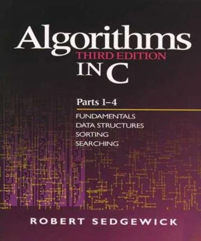

# sedgewick

Answers to selected exercises from Robert Sedgewick's _Algorithms in C_ (1998, third edition).

    

## Acknowledgements

_This project was initialized using [Copier](https://pypi.org/project/copier) and the [copier-template-for-c-projects](https://github.com/jspaaks/copier-template-for-c-projects)._

